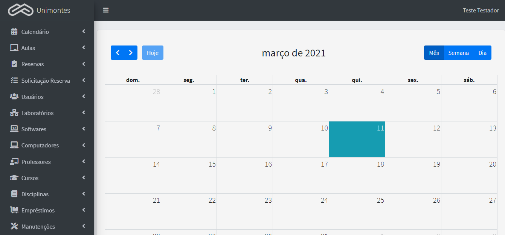
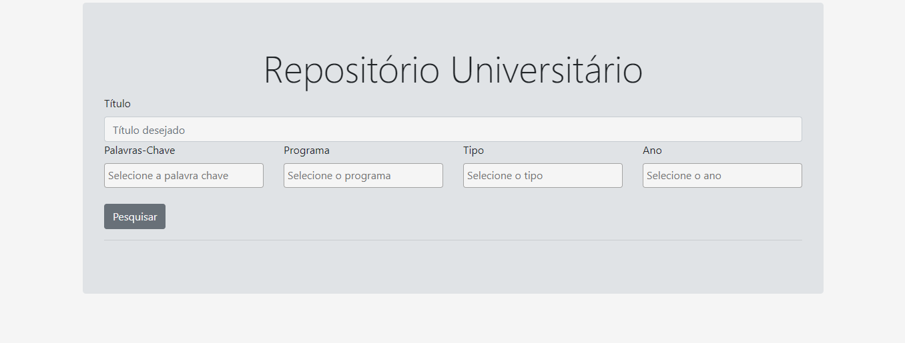
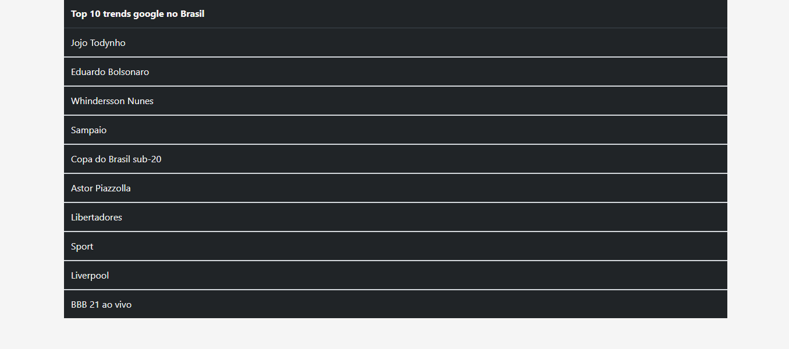
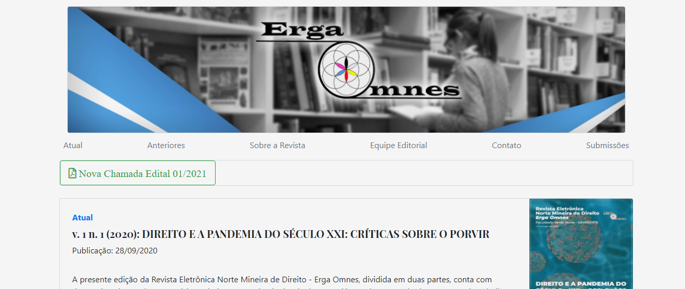
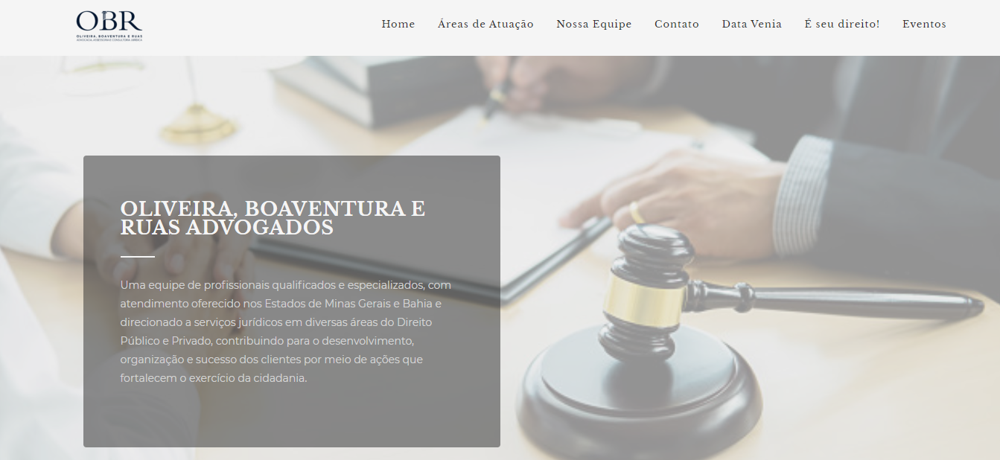
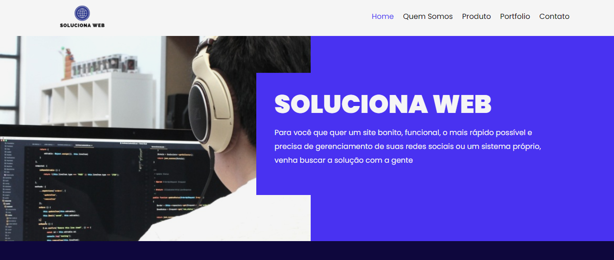
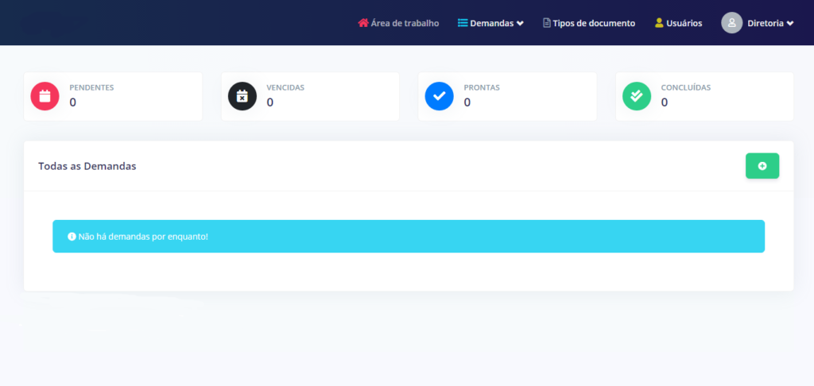

_______________________________________________________________________________________________________________________
## Sistema de Controle de Laboratórios

Projeto no meu TCC. É uma aplicação para gerenciar os laboratórios de informática do Centro de Ciências Exatas (CCET).
Desenvolvido com Python e Django.

[Github](https://github.com/Italo11Marcos/django-lab-control-tcc)

_______________________________________________________________________________________________________________________
## Sistema de Avaliação de Currículos - (SIAC)

Projeto desenvolvido utlizandos várias libs do python como requests, beautifulsoup4, pandas, numpy, matplotlib, no curso 
de Sistemas de Informação na Unimontes que tem como objetivo extriar dados dos currículos da plataforma Lattes.

[Github](https://github.com/Italo11Marcos/siac)

_______________________________________________________________________________________________________________________
## Repositório Universitário

Projeto que desenvolvi para servir de base para ser um repositório de artigos, dissertações, monografias, etc. 
Desenvolvido com Python e Django.

[Github](https://github.com/Italo11Marcos/repositorio-universitario)

_______________________________________________________________________________________________________________________
## Pytrends

Projeto que desenvolvi para testar a lib [pytrends](https://pypi.org/project/pytrends/). É uma simples aplicação
desenvolvida com Python e Flask que mostra o top 10 trends do google na Brasil.

[Github](https://github.com/Italo11Marcos/flask-pytrends-brasil)

_______________________________________________________________________________________________________________________
## Revista ErgaOmnes

Projeto para gerênciamento de periódicos acadêmicos. É uma simples alternativa para o [OJS](https://pkp.sfu.ca/ojs/).
Desenvolvido com PHP e Laravel.

[Github](https://github.com/Italo11Marcos/revista-eletronica)

[Revista ErgaOmnes](http://revistaergaomnes.com.br/)

______________________________________________________________________________________________________________________
## OBR Advogados

Site Institucional em Wordpress para advogados.

[OBR Advogados](https://obradvogados.com/)

________________________________________________________________________________________________________________________
## Soluciona WEB

Site Institucional em wordpress para a equipe Soluciona WEB.

[Soluciona WEB](https://solucionaweb.com.br/)

_________________________________________________________________________________________________________________________
## SCD

Sistema de Controle de Demandas, desenvolvido com PHP e Laravel, tem como finalidade fazer o controle de demandas que
chegam, direcionando para quem será o resposável por atender, quem fez a solicitação, definir os prazos de entrega...

_______________________________________________________________________________________________________________________